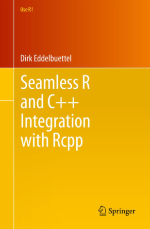

# Very Basic Introduction to C++ and R

C++ is a powerful object-oriented programming language. The initial
idea behind C++ was to extend the C language in a flexible way. Also,
C++ provides high-level features for program organization. In this
brief introduction, we will focus mostly on the similarities of C++
and C and how to integrate it with R using the package
[Rcpp](http://www.rcpp.org/ "Rcpp").


##Introduction to C++

First, let us start with some basic C++ examples. The very first
example is the famous "Hello world!"


###Hello world!

``` c++ 
#include <iostream>
int main()
{
    std::cout << "Hello, world!\n";
}
```
or yet

``` c++ 
#include <iostream>
using namespace std;
int main()
{
    cout << "Hello, world!\n";
}
```
In contrast to R, a C++ code needs to be compiled, i.e. the human
readable language needs to be translated into a binary code. The
reason for this conversion is to create an executable program.


In this turorial, we will use the C++ GNU compiler (g++), which is part of the [**GNU Compiler Collection**](https://gcc.gnu.org/ "GNU Compiler Collection").
Usually, a compiler has its own syntax with specific flags. For a very
comprehensive list of flags for the GNU Compiler Collection, visit
[GCC Preprocessor Options](https://gcc.gnu.org/onlinedocs/gcc-3.4.4/gcc/Preprocessor-Options.html
"GCC Preprocessor Options").

``` bash
g++ hello.cpp -O2 -Wformat -o hello
```

## The `for` loop

In the next example, a `for` loop is used to print all integer numbers
from `a` to `b`:


``` c++ 
#include <iostream>
using namespace std;
int main()
{
  int a;
  int b;
  cout << "Enter the first number: ";
  cin >> a;
  cout << "\n";
  cout << "Enter the second number: ";
  cin >> b;
  cout << "\n";
  for(a; a < b; a++)
    {
        cout << a << "\n";
    }
}
```
Compiling

``` bash
g++ for_example.cpp -O2 -Wformat -o for_exemple
```

###Backcross example

Now, let us write a C++ code to calculate the recombination fraction
in a backcross population: 

``` c++ 
#include <iostream>
#include <vector>
#include <fstream> 
#include <string>
#include<iomanip>

using namespace std;
int main()
{


  int n_mar;
  int n_ind;
  double ct;
  cout << "Enter the number of markers: ";
  cin >> n_mar;
  cout << "\n";
  cout << "Enter the number of individuals: ";
  cin >> n_ind;
  cout << "\n";
  string filename;
  ifstream in;
  cout << "Enter the name of the input file ";
  cin >> filename;
  in.open( filename.c_str() );
  if (!in) {
    cout << "Cannot open file.\n";
    return (-1);
  }
  std::vector<std::vector<int> > geno(n_ind, std::vector<int>(n_mar, 0));
  std::vector<std::vector<double> > rec(n_mar, std::vector<double>(n_mar, 0.5));
  for (int i = 0; i < geno.size(); i++) {
    for (int j = 0; j < geno[1].size(); j++) {
      in >> geno[i][j];
    }
  }
  in.close();

  for (int i = 0; i < (n_mar-1); i++) 
    {
      for (int j = (i+1); j < n_mar; j++) 
	{
	  ct=0.0;
	  for(int k=0; k < n_ind; k++)
	    {
	      if(geno[k][i]!=geno[k][j])
		ct++;
	    }
	  rec[i][j]=ct/n_ind;
	}
    }

  ofstream fout("rec_cpp.txt"); //opening an output stream fo
  for (int i = 0; i < n_mar; i++) 
    {
      for (int j = 0; j < n_mar; j++) 
	{
	  fout << rec[i][j] << " ";
	}
      fout << "\n";
    }
}
```
Compiling and running

``` bash
$ g++ bc_est.cpp -O2 -Wformat -o bc est
$ ./bcest
$ Enter the number of markers: 14
$ Enter the number of individuals: 103
$ Enter the name of the input file mouse.txt
$ cat rec_cpp.txt
```
### Backcross example - R version

``` r 
dat<-read.table("mouse.txt")
id<-combn(1:ncol(dat),2)
rec<-apply(id, 2, function(x) sum(table(dat[,x[1]],dat[,x[2]])[2:3])/nrow(dat))
names(rec)<-apply(id, 2, paste, collapse="-")
rec
```

## Why integrate C++ and R

### Backcross - a more realistic example

Now let us simulate a backcross example with one chromosome, 200
individuals and 500 markers:


``` r 
source("simulate_diploid_populations.R")
require(onemap)
dat.bc<-sim.pop.bc(n.ind = 250, n.mrk = 500, ch.len = 200, missing = 0, n.ch = 1, verbose = FALSE)
dat.bc
dat<-dat.bc$geno
write.table(x=dat, file = "fake_bc.txt", row.names = FALSE, col.names = FALSE, quote = FALSE, sep = " ")
```
Using R to obtain the recombination fractions

``` r
rec<-matrix(NA,ncol(dat), ncol(dat))
for(i in 1:(ncol(dat)-1)){
  for(j in (i+1):ncol(dat)){
    rec[i,j]<-sum(table(dat[,i], dat[,j])[2:3])/nrow(dat)
  }
}
require(fields)
image.plot(rec, col=rev(tim.colors()))

```

Using our C++ program

``` bash
$ ./bcest
$ Enter the number of markers: 500
$ Enter the number of individuals: 250
$ Enter the name of the input file: fake_bc.txt
```

``` r 
y<-read.table(file = "rec_cpp.txt")
image.plot(as.matrix(y), col=rev(tim.colors()) )
```
Compare the times of execution. 

**C++ is really efficient!**


##Integrating R and C++

At this point it seems to be obvious why one would use a C++ routine
intead R to make any computation in a large amount of data. Now, let
us integrate both. Theoretically, it is possible to integarte R and C++ using no packages
at all. However the integration is way easier if we use the package
[Rcpp](http://www.rcpp.org/ "Rcpp").


###Resources

There is plenty of resources spread all over the internet on this
subject. Here I am going to share some of my favorite. The following
figure shows all the packages that depend on, is linked or imports
Rcpp:


<br>

[](https://cran.r-project.org/web/packages/Rcpp/index.html)

<br>

[Dirk Eddelbuettel's](https://github.com/eddelbuettel) Rcpp book.

[](http://www.springer.com/us/book/9781461468677).

<br>

Very useful [Quick reference guide](https://cran.r-project.org/web/packages/Rcpp/vignettes/Rcpp-quickref.pdf).
 
<br>

Let us use it!

###Ways to use Rcpp

There are basically three ways to use RCpp and R: using the package
`inline`, using the function `sourceCpp`or embedded into a R package.


####Using the package `inline`

In R console, write the C++ code and save it in a string. In order to
C++ and R communicate to each other, it is necessary to use RCpp
constructors, like `Rcpp::NumericMatrix`.


``` r 
src<-'
    Rcpp::NumericMatrix geno(genoR);
    int n_ind = geno.nrow();
    int n_mar = geno.ncol();
    Rcpp::NumericMatrix rec(n_mar, n_mar);
    double ct;
    for (int i = 0; i < (n_mar-1); i++) 
    {
        for (int j = (i+1); j < n_mar; j++) 
	{
            ct=0.0;
            for(int k=0; k < n_ind; k++)
	    {
                if(geno(k,i)!=geno(k,j))
                    ct++;
                    }
            rec(j,i)=rec(i,j)=ct/n_ind;
	}
    }
    return(rec);
    '
```

Then, we need to compile the program and make it available to R using
the following code:

``` r 
require(Rcpp)
require(inline)
est_bc_inline <- cxxfunction(signature(genoR = "numeric"), body = src, plugin="Rcpp")
```

The compilation process in this case is quite similar to the "pure"
C++ compilation; However, instead of generating a executable file, it
generates a "shared object" which R is capable to load:


Now, it is just use it:

``` r 
dat<-as.matrix(read.table("mouse.txt"))
rec<-est_bc_inline(dat)
require(fields)
image.plot(rec, col=rev(tim.colors()))
```

A more realistic example:

``` r 
##5000 markers
source("simulate_diploid_populations.R")
require(onemap)
dat.bc<-sim.pop.bc(n.ind = 250, n.mrk = 5000, ch.len = 200, missing = 0, n.ch = 1, verbose = FALSE)
dat.bc
dat.bc.t<-dat.bc$geno
system.time(rec<-est_bc_inline(dat.bc.t))
choose(5000, 2)
image.plot(rec, col=rev(tim.colors()))
```

####Using the function `sourceCpp`

This approach is pretty similar to the `inline`. Here, instead to write
a code as a string in R, we use a separated `cpp` file with the
directive `// [[Rcpp::export]]`.

According to
[Hadley Wickham's page](http://adv-r.had.co.nz/C-interface.html), at
the C-level, all R objects are stored in a common datatype, the SEXP,
or S-expression. All R objects are S-expressions so every C function
that you create must return a SEXP as output and take SEXPs as
inputs. (Technically, this is a pointer to a structure with typedef
SEXPREC.). Take a moment to read Wickham's page. You will see a lot of
"behind the scenes" about the integration C and R, which is more or
less applied to C++.

Moreover, using the sourceRcpp page, it is possible to include
external header files. We will address that in the next section.

``` c++
#include <Rcpp.h>

// [[Rcpp::export]]
SEXP est_bc_source(Rcpp::NumericMatrix genoR) {
  Rcpp::NumericMatrix geno(genoR);
  int n_ind = geno.nrow();
  int n_mar = geno.ncol();
  Rcpp::NumericMatrix rec(n_mar, n_mar);
  double ct;
  for (int i = 0; i < (n_mar-1); i++) 
    {
      for (int j = (i+1); j < n_mar; j++) 
	{
	  ct=0.0;
	  for(int k=0; k < n_ind; k++)
	    {
	      if(geno(k,i)!=geno(k,j))
		ct++;
	    }
	  rec(j,i)=rec(i,j)=ct/n_ind;
	}
    }
  return(rec);
}
```

Save the code in a file named "rcpp_source_example.cpp", for example
and load the C++ code in R using

``` r 
require(Rcpp)
sourceCpp("rcpp_source_example.cpp")
system.time(rec<-est_bc_source(dat.bc.t))
choose(5000, 2)
image.plot(rec, col=rev(tim.colors()))
```

##Creating packages in R with C++ code embedded

This is the most tricky and, at the same time, most powerful way to
use C++ codes in R. Here we will construct a package that computes
recombination fractions in backcross, F2 and outcross experimental
populations. This topic does not intent to teach how to build a
package, nevertheless, if you follow the steps described here, you
will be able to understand the structure and how to compile a package
using R and C++.

### Preliminaries

1. Create a new empty GitHub repository

2. Install packages `devtools` and `roxygen2`

``` r 
install.packages("devtools")
require("devtools")
devtools::install_github("klutometis/roxygen")
require(roxygen2)
```

###Create package structure and push it to GitHub


3. Create the package structure. Lat us name our package **rfpack**.

``` r 
create("rfpack")
```

4. Modify DESCRIPTION file

```
Package: rfpack
Title: Computes recombination fraction in experimental populations
Version: 0.0.0.9000
Authors@R: person("Marcelo", "Mollinari", email = "mmollina@gmail.com", role = c("aut", "cre"))
Description: Computes recombination fraction in experimental populations: backcross, F2 and outcrossing species
Depends: R (>= 3.2.2)
License: GPL (>= 3.0)
Imports: Rcpp (>= 0.12.1), onemap, fields
LinkingTo: Rcpp
```


5. Now, let us push this modifications to GitHub repository. Go to the terminal and type:

``` bash
$ cd ~/repos/rfpack
$ git init
$ git add .
$ git commit -m 'Initial commit'
$ git remote add origin git@github.com:mmollina/rfpack.git
$ git push -u origin master
```
###Inserting Cpp code
6. Create a `src` (source code) directory. This directory will contain
   the C++ source code. Also, C and FORTRAN codes could be located in this
   directory.
   
7. In this example, I subdivided all C++ functions in several cpp files with their respective
   header files:
   
  - twopt_est_bc.cpp
  - twopt_est_f2.cpp
  - twopt_est_out.cpp
  - f2_est.cpp 
  - out_est.cpp 
  - utils.cpp 
  
  Let us take a look into each one of these files
  [here](https://github.com/mmollina/rfpack/tree/master/src). The key
  here is to separate functions into several files and connect them
  through their header files. Let us take a look at `utils.cpp`
  function:
  
  ``` c++
  #include <Rcpp.h>
  using namespace Rcpp;
  using namespace std;

  Rcpp::NumericMatrix transpose_counts(Rcpp::NumericMatrix n)
  {
    int temp;
    temp=n(1,2); n(1,2)=n(2,1); n(2,1)=temp;
    temp=n(1,3); n(1,3)=n(3,1); n(3,1)=temp;
    temp=n(1,4); n(1,4)=n(4,1); n(4,1)=temp;
    temp=n(2,3); n(2,3)=n(3,2); n(3,2)=temp;
    temp=n(2,4); n(2,4)=n(4,2); n(4,2)=temp;
    temp=n(3,4); n(3,4)=n(4,3); n(4,3)=temp;
    return(n);
  }
  ```
  The previous function, is a simple function that transposes a matrix
  (4 x 4). Its associated header file is:
  
  
  ``` c++
  #include <Rcpp.h>
  using namespace Rcpp;
  using namespace std;

  Rcpp::NumericMatrix transpose_counts(Rcpp::NumericMatrix n);

  ```
  Notice that this function is used in function `est_rf_out`, file
  `twopts_out.cpp`. What makes it possible is that, at the beginning 
  of `twopts_out.cpp`, we included `utils.h` header file:
  
  
  ``` c++
  #include "utils.h"
  ```
  
  It is also important to notice that the type returned by the function
  `transpose_counts` is `Rcpp::NumericMatrix`, which is exactly the
  type used when calling `transpose_counts` inside `est_rf_out`.
  
### Add R functions and documentation

8. Here we will create three R files: `simulate_pop.R` which contains a
   wrapper for the simulation procedures, `est_rf` which contains a
   wrapper to the recombination fraction estimation procedure and
   `utils.R` which contains all function related to the simulation
   procedure and the wrapper to the C++ code which performs the real
   estimation of recombination fraction. Let us take a look into each
   one of these files
   [here](https://github.com/mmollina/rfpack/tree/master/R).

   Most importantly, take a close look at the functions that use
   `.Call`. Here is an example:

``` r
est_out<-function(geno, seg_type=NULL, nind)
{
  r<-.Call("est_rf_out",
           geno,
           as.numeric(seg_type),
           as.numeric(nind),
           options()$width-6,
           PACKAGE = "rfpack" )
  names(r)<-c("CC", "CR", "RC", "RR")
  for(i in 1:4) dimnames(r[[i]])<-list(colnames(geno), colnames(geno))
  return(r)
}
```

This is the syntax to call a C++ function inside R though Rcpp. The
first argument is the name of the C++ function the following arguments
are the ones into the C++ function and the last one is the name of the
package. This function returns a R `list`. This is due to how we return
the results in the
[C++ code](https://github.com/mmollina/rfpack/blob/master/src/twopt_est_out.cpp).


9. In this example, we use `roxygen2` to handle the documentation. Its
   syntax is quite simple. Here is an example of the function
   `simulate_poly`. This header should be placed at the beginning of
   the R file that contains the function `simulate_pop`
   

``` r
#' A Simulation function
#'
#' This function simulates experimental crosses: backcross, F2 and outcrossing populations.
#' @param type type of cross. Must be one of the following: "bc" fro backcross, "f2" for f2 and "out" fro outcross.
#' @param n.ind number of individuals
#' @param n.mrk number of markers
#' @param ch.len length of chromosome in centimorgans
#' @param missing percentage of missing data
#' @param n.ch number of chromosomes
#' @param dom43 if \code{type=="f2"}, percentage of dominant markers NOT BB, BB
#' @param dom51 if \code{type=="f2"}, percentage of dominant markers NOT AA, AA
#' @param prob if \code{type=="out"}, probability of markers types A, B1, B2, B3, C, D1 and D2
#' @param verbose logical. If \code{TRUE}, prints the progress of the simulation per chromosome.
#' @export
#' @examples
#' dat<-simulate_pop(type="f2", n.ind = 250,
#'                   n.mrk = 1000, ch.len = 200,
#'                   missing = 15, dom43 = 20,
#'                   dom51 = 20, n.ch = 2,
#'                   verbose = TRUE)
#' require(onemap)
#' dat
```

###Compiling documentation
10. In Rstudio, in the `Build` tab, click in `more` and then in `Document`

11. Manually, create `rfpack-internal.Rd` file containing the with the 
    internal that should not be directly called by the user:

``` r
\name{rfpack-internal}
\alias{check.type}
\alias{est_bc}
\alias{est_f2}
\alias{est_out}
\alias{imf.k}
\alias{mf.k}
\alias{sim.gam}
\alias{sim.pop.bc}
\alias{sim.pop.f2}
\alias{sim.pop.out}

\title{Internal rfpack functions}
\description{
  Functions from \pkg{rfpack} not to be directly called by the user.
}
\usage{
est_out(geno, seg_type=NULL, nind)
est_f2(geno, seg_type=NULL, nind)
est_bc(geno, nind)
mf.k (d)
imf.k (r)
sim.gam(n.mrk, r, init=0)
sim.pop.bc(n.ind, n.mrk, ch.len, missing=0, n.ch=1, verbose=TRUE)
check.type(x)
sim.pop.f2(n.ind, n.mrk, ch.len, dom43=0, dom51=0, missing=0, n.ch=1, verbose=TRUE)
sim.pop.out(n.ind, n.mrk, ch.len, missing=0, prob=c(1,1,1,1,1,1,1), n.ch=1, verbose=TRUE)
}
\author{Marcelo Mollinari}
\keyword{internal}

```

###Checking and building the package

12. In order to Rcpp finds the shared libraries, we need to modify the NAMESPACE file. 
If `roxygen2` created a  NAMESPACE file, you should delete first comment line and add the
following lines:

```
useDynLib(rfpack)
exportPattern("^[[:alpha:]]+")
importFrom(Rcpp, evalCpp)
```

13. Now, click in `check`. Rstudio will use `devtools` to make
    all checks in our package. This automatically compile the
    documentation and check for all sorts of errors, warnings and
    notes. Probably we will get some of them, it is normal at the first time.
    If you want to submit your pacjage to `CRAN`, all steps shoud 
    pass trough the check procedure marked with OK! It could take 
    some time to figure out some of the errors. But again, it is 
    completely normal, just take your time and lots of research on 
    internet and you will fix the errors.
    Since your package were checked, you can click in `Build & Reload` 
    button and use it!
    
14. So, let us use our package!

``` r
require(rfpack)
dat<-simulate_pop(type="f2", n.ind = 250,
                   n.mrk = 1000, ch.len = 200,
                   dom43 = 20, dom51 = 20,
                   missing = 15, n.ch = 2,
                   verbose = TRUE)
require(onemap)
dat
system.time(r<-est_rf(dat))
round(r[1:10, 1:10],3)

require(fields)
image.plot(as.matrix(as.dist(r, upper=TRUE, diag=TRUE)), col=rev(tim.colors()))
```


